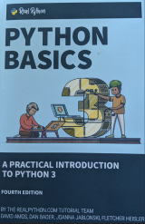

# Python Basics: Companion Notes

## Daniel Morris, PhD
___

These are companion notes that summarize and add some material to the Python concepts taught in the following book:   

### **[Python Basics: A Practical Introduction to Python 3](https://realpython.com/products/python-basics-book/)**
### By: **David Amos, Dan Bader, Joanna Jablonski, Fletcher Heisler**
4th edition, 2021

___
## **Outline**

* [Chapter 1: Introduction](Chapter_01_Introduction.md) `*`
* [Chapter 2: Install Python and an IDE](Chapter_02_Installation_and_IDE.ipynb) `*`
* [Chapter 3: Python Programs](Chapter_03_Python_Programs.md)
* [Chapter 4: Strings and Indexing](Chapter_04_Strings_and_Indexing.md)
* [Chapter 5: Numbers and Math](Chapter_05_Numbers_and_Math.md)
* [Chapter 6: Functions and Loops](Chapter_06_Functions_and_Loops.md)
* [Chapter 7: Debug in VSCode](Chapter_07_Debug_in_VSCode.md) `*`
* [Chapter 8: Conditional Logic and Control Flow](Chapter_08_Conditional_Logic_and_Control_Flow.md)
* [Chapter 9: Tuples, Lists and Dictionaries](Chapter_09_Tuples_Lists_and_Dictionaries.md)
* [Chapter 10: Classes](Chapter_10_Classes.md)
* [Chapter 11: Modules and Packages](Chapter_11_Modules_and_Packages.md)
* [Chapter 12: Virtual Environments](Chapter_12_Virtual_Environments.md) `*`
* [Chapter 13: Numpy](Chapter_13_Numpy.ipynb) `*`
* [Chapter 14: Scipy](Chapter_14_Scipy.ipynb) `*`
* [Chapter 15: OpenCV](Chapter_15_OpenCV.ipynb) `*`
* [Chapter 16: Matplotlib](Chapter_16_Matplotlib.ipynb) `*`
* [Chapter 17: Solve Linear Equations](Chapter_17_Linear_Equations.ipynb) `*`
* [Chapter 18: Pandas for Time Series Data](Chapter_18_Pandas_for_Time_Series_Data.ipynb) `*`

`*` These chapter topics differ significantly from those in the book.

___
## Who Are These Notes For?

The notes are self-contained but fairly terse, and are intended for someone versed in other programming languages to quickly learn the syntax, style and peculiarities of Python.  Hence, given some programming background, they can be followed without using the book.  

The notes are also only a basic introduction to Python and are not comprehensive.  After completing them you should be comfortable programming basic capabililties in Python.  Once you are at that level, it is fairly simple to learn new features through a web or [Stack Overflow](https://stackoverflow.com/) search.  

If, on the other hand, you are new to programming, then these notes may be too terse, and it would be preferable to follow the book or do an [online tutorial](https://docs.python.org/3/tutorial/index.html).    

___
### Next: [Chapter 1: Introduction](Chapter_01_Introduction.md)
